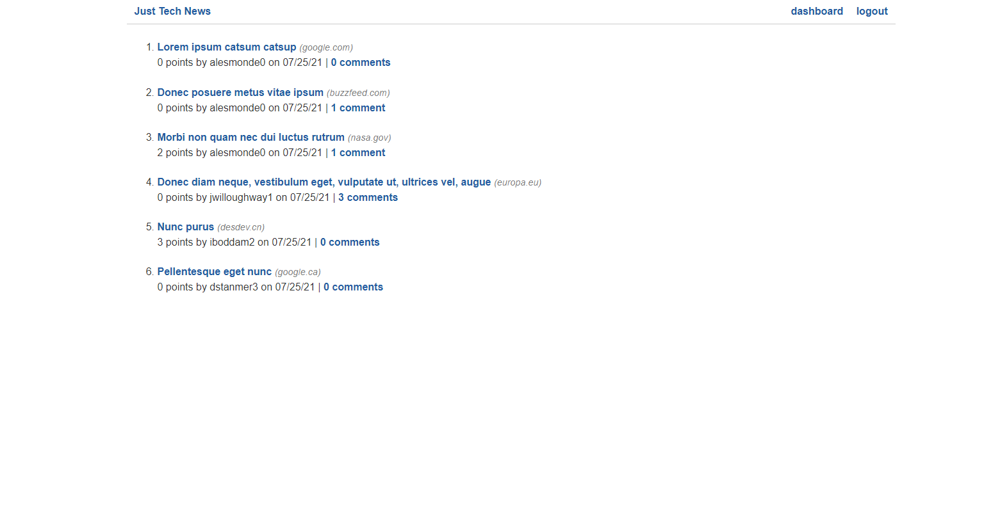

# Just Tech News Site

## Description

Want to tell the world about tech news?

This news site will give you a platform to share tech news with others. Simply sign-up for an account after clicking through login, then you'll be able to share news posts via the Dashboard's Create New Post form. Simply type in your title and the link to the news article you wish to share. After you've posted your knowledge, it'll show up on the home page where you can leave comments on other people's news links, too. You can edit or delete your post at any time by going back to the Dashboard and clicking on the post that needs modified.

Get ready to spread news and connect with the tech world through this helpful news site!

This blog was written in Python, JavaScript and uses Flask, HTML5, CSS3, SQLAlchemy, PyMySQL/MySQL/JawsDB, bcrypt, Jinja2, and Gunicorn. It's deployed on Heroku.

## Table of Contents

* [Description](#description)
* [Installation](#installation)
* [Usage](#usage)
* [Credits](#credits)
* [License](#license)

## Installation

To install the application's dependencies, type the following:
```md
pip install
```
To start your virtual environment on macOS or Linux, type:
```md
. venv/bin/activate
```
To start your virtual environment on Windows, type:
```md
.\venv\Scripts\activate
```
Be sure to access your MySQL shell with:
```md
mysql -u root -p
```
Next create the initial database with:
```md
CREATE DATABASE python_news_db;
```
To run seed the database, type: 
```md
python seeds.py
```
To run the server, type the following:
```md
python -m flask run
```

Once those steps are done, you can view the application in your browser using http://127.0.0.1:5000/.

## Usage



Navigate to [Soma Mäkelä's Python News Site](https://python-tech-news.herokuapp.com/) and view the web page.

* Once you're there, sign-up for an account through clicking on log-in.
* Create a news post.
* View someone else's post.
* Comment on someone else's post.
* Edit your post.


## Credits

Created by [Soma Mäkelä](https://github.com/smakela13).

## License

This website currently has No License, which means it is under exclusive copyright. No one can copy, distribute, or modify this website without permission.
